  

 

  
  
  
  

 

  

 

<table>
<tr>
<td width="53%" valign="top">

## `01 / PROFILE`

### I design and build interfaces where visual craft, interaction, and engineering operate as one system.

I’m **luanthnh**, a frontend developer based in **Đà Nẵng, Việt Nam**. I work on expressive product interfaces, practical automation tools, and systems that remove friction from real workflows.

- Creative frontend and product engineering
- Motion and interaction with a clear purpose
- Responsive, maintainable interface systems
- Automation that saves measurable working time
- React, Next.js, Nuxt, Node.js and Python

> **Current signal:** building tools that feel considered, behave reliably, and remain useful after the first impression.

</td>
<td width="47%" valign="middle">

</td>
</tr>
</table>

---

## `02 / SELECTED SYSTEMS`

<table>
<tr>
<td width="50%" valign="top">

</td>
<td width="50%" valign="top">

</td>
</tr>
<tr>
<td width="50%" valign="top">

</td>
<td width="50%" valign="top">

</td>
</tr>
</table>

  <a href="https://github.com/luan-thnh?tab=repositories"><strong>VIEW COMPLETE ARCHIVE →</strong></a>

---

## `03 / SIGNAL FIELD`

<table>
<tr>
<td width="50%" valign="middle">

</td>
<td width="50%" valign="middle">

</td>
</tr>
</table>

---

## `04 / YEAR IN CODE`

<table>
<tr>
<td width="50%" valign="middle">

</td>
<td width="50%" valign="middle">

</td>
</tr>
</table>

---

## `05 / ACTIVITY TRACE`

  

---

## `06 / CONTRIBUTION SNAKE`

<picture>
  <source media="(prefers-color-scheme: dark)" srcset="https://raw.githubusercontent.com/luan-thnh/luan-thnh/output/github-snake-alive-dark.svg">
  <source media="(prefers-color-scheme: light)" srcset="https://raw.githubusercontent.com/luan-thnh/luan-thnh/output/github-snake-alive-light.svg">
  
</picture>

<table>
<tr>
<td width="68%" valign="middle">

## `07 / OPEN CHANNEL`

### Have an interface problem, product idea, or repetitive workflow worth improving?

I’m interested in work where frontend engineering, product thinking, visual craft, and automation need to operate together.

</td>
<td width="32%" valign="middle" align="right">

</td>
</tr>
</table>

  Live profile components powered by <a href="https://alive-github-signals.vercel.app/">Alive GitHub Signals</a>.

