  

 

  
  
  
  

 

---

## `01 / PROFILE`

### I design and build interfaces where visual craft, interaction, and engineering operate as one system.

I’m **luanthnh**, a frontend developer based in **Đà Nẵng, Việt Nam**. I work on expressive product interfaces, practical automation tools, and systems that remove friction from real workflows.

`CREATIVE FRONTEND` · `PRODUCT SYSTEMS` · `MOTION` · `AUTOMATION`

---

## `02 / SYSTEM ARCHIVE`

  <a href="https://github.com/luan-thnh?tab=repositories"><strong>VIEW COMPLETE ARCHIVE →</strong></a>

---

## `03 / SIGNAL FIELD`

 

 

---

## `04 / YEAR IN CODE`

 

 

---

## `05 / ACTIVITY TRACE`

---

## `06 / CONTRIBUTION SNAKE`

<picture>
  <source media="(prefers-color-scheme: dark)" srcset="https://raw.githubusercontent.com/luan-thnh/luan-thnh/output/github-snake-alive-dark.svg">
  <source media="(prefers-color-scheme: light)" srcset="https://raw.githubusercontent.com/luan-thnh/luan-thnh/output/github-snake-alive-light.svg">
  
</picture>

---

## `07 / OPEN CHANNEL`

### Have an interface problem, product idea, or repetitive workflow worth improving?

I’m interested in work where frontend engineering, product thinking, visual craft, and automation need to operate together.

  

  Live components powered by <a href="https://alive-github-signals.vercel.app/">Alive GitHub Signals</a>.

